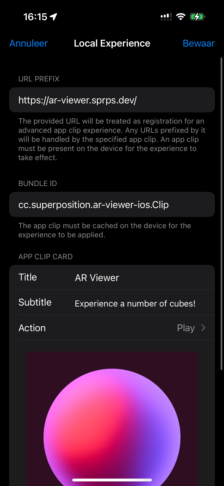

# AR Viewer for iOS

	
	

		<i>An easy way to create augmented reality experiences on iOS — the foundation under ARSynth</i>
	

## 🤷🏻‍♂️ Why?

Augmented Reality is a powerful technology. However, it has a big usability issue: developers have to choose between offering a seriously flawed experience using lesser technologies, or having their audience download an app that offers ARKit functionality. This is a serious hurdle for users to open an experience. AR Viewer is a minimal example of bridging both worlds: using an iOS App Clip to offer ARKit scenes that can be dynamically generated without the user having to download an app. All the user has to do is scan a QR code.

## 🛠️ Instructions

You will need to associate a domain with your app and add it in XCode under `Signing & Capabilities`. In the example, a domain has already been added. This domain comes back in a few different places:
  - In the Associated Domains capability
  - In `ar_viewer_ios_app_clipApp.swift`, where the app clip receives data from the QR code
  - In the App Clip's Run Scheme Settings — where an App Clip Invocation URL can be configured, which is the URL that the app clip receives when testing from XCode

## 😎 Testing

To test the experience, register a Local Experience on your iOS. You can do this under Settings > Developer > Local Experiences. See the screenshot below for an example. Then, open `example/index.html` in your browser. It reveals a simple interface that allows you to set a number of objects to spawn and displays a QR code that launches the augmented reality viewer.

	

